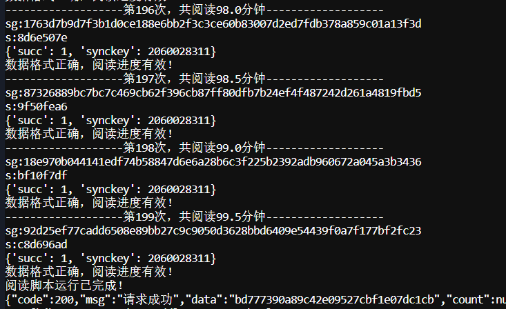
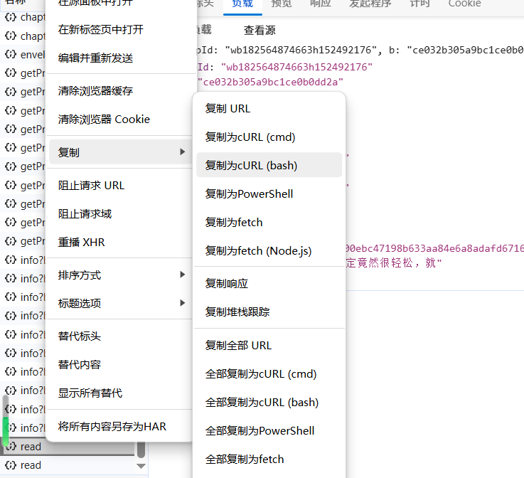
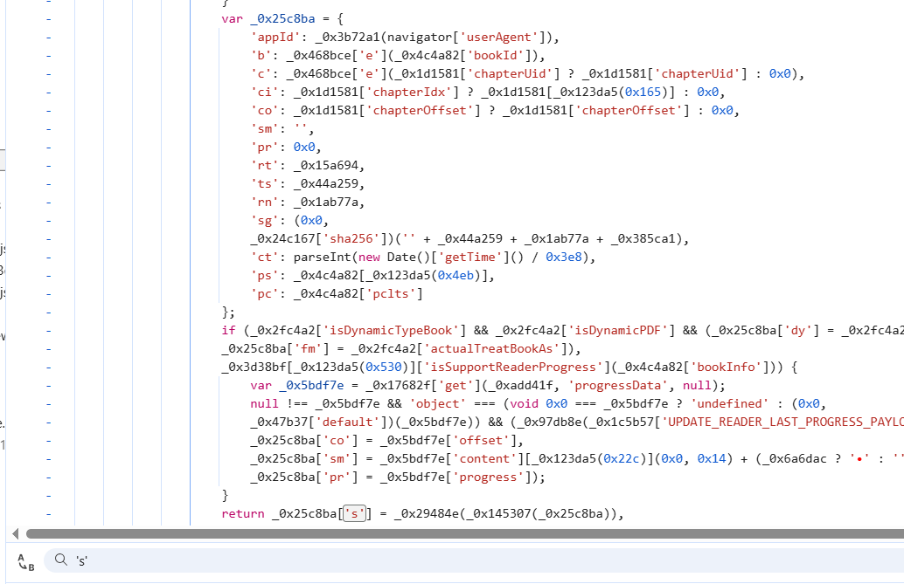
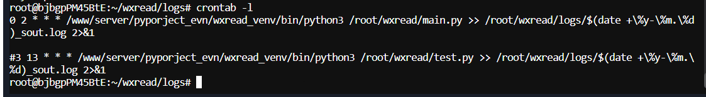
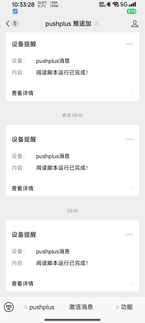

*推一下自己和朋友搭的一个机场，前期试运营，优惠从优<br>
【科学上网】机场地址--->[R星云](https://api123.rstar.cloud/)<---机场地址【科学上网】<br>
觉得这个项目对你有帮助恰巧你需要节点的话可以看一下<br>*

## Attention 📢

1. **签到次数调整**：只需完成签到将`num`次数从120调整为2，每次`num`为30秒，200即100分钟。
   
2. **解决阅读时间问题**：对于issue中提出的“阅读时间没有增加”，“增加时间与刷的时间不对等”建议替换`capture.py`中的【headers】、【cookies】字段。保留【data】字段。

3. **GitHub Action部署**：使用GitHub action部署时去掉抓包得到的`headers=`、`cookies=`，填入后面的字典格式。

***
## 项目介绍 📚

开发这个脚本的主要目的是为了在微信读书的阅读挑战赛中刷时长和天数。由于本人偶尔看书时未能及时签到，导致入场费打了水漂。网上找了一些，发现高赞的自动阅读需要挂虚拟器模拟或者用ADB模拟，实现一点也不优雅。因此，我决定编写一个自动化脚本。通过对官网接口的抓包和JS逆向分析，脚本能够解析各接口请求，分析字段拼接方式，并对字段进行加密和计算处理，确保服务器成功响应。

该脚本具备以下功能：

- **自动刷阅读时长**：默认计入排行榜和挑战赛，时长可调节，默认为60分钟。
- **定时运行**：可部署在GitHub Action/服务器上，支持每天定时运行并推送结果到微信。
- **Cookie自动更新**：一次抓包后，脚本能自动获取并更新Cookie，支持长时间使用。
- **轻量化设计**：相比市面上的ADB调试器和自动阅读器，本脚本实现了轻量化的编写，部署服务器即可运行，无需额外环境条件。

***
## 操作步骤（v3.0） 🛠️

### 1. 抓包准备（适合本地运行）

脚本逻辑还是比较简单的，`main.py`与`push.py`代码不需要改动。在微信阅读官网 [微信读书](https://weread.qq.com/) 搜索【三体】点开阅读点击下一页进行抓包，抓到`read`接口 `https://weread.qq.com/web/book/read`，如果返回格式正常（如：

```json
{
  "succ": 1,
  "synckey": 564589834
}
```

右键复制为Bash格式，然后在 [Convert](https://curlconverter.com/python/) 转化为Python脚本，复制需要的headers与cookies字段替换到`capture.py`（data字段保留），运行`main.py`即可，依赖自行安装。

### 2. GitHub Action部署运行（GitHub运行）

Fork这个仓库，在仓库【Settings】-左侧列表【Secrets and variables】-【Actions】-右侧【Secrets】下方【Repository secrets】填入header、cookie及其它值（去掉抓包得到的`headers=`，`cookies=`，填入后面的字典格式），`read_num`填入【Variables】最下方。在本仓库【Actions】启用workflow，选择运行即可。

| Key                  | Value                                                             | 说明                                      |
|----------------------|-------------------------------------------------------------------|-------------------------------------------|
| `WXREAD_HEADERS`      | 微信读书headers (必填)                                            | 必须提供有效的请求头                     |
| `WXREAD_COOKIES`      | 微信读书cookies (必填)                                          | 必须提供有效的cookies                    |
| `READ_NUM`           | 阅读时长，每次代表30秒(可选)                                   | 控制阅读时长，默认60分钟                     |
| `PUSH_METHOD`        | 推送方式，可选值为 `pushplus` 或 `telegram` (可选)               | 选择推送方式，默认不推送                             |
| `PUSHPLUS_TOKEN`      | pushplus token (可选)                                           | 仅在选择 `pushplus` 时需要填写          |
| `TELEGRAM_BOT_TOKEN`  | telegram bot token (可选)                                       | 仅在选择 `telegram` 时需要填写         |
| `TELEGRAM_CHAT_ID`    | telegram chat id (可选)                                         | 仅在选择 `telegram` 时需要填写         |


### 3. 服务器运行（可选）

在你的服务器上有Python运行环境即可，使用`cron`定义自动运行。（如：

```bash
0 2 * * * /www/server/pyproject_env/wxread_venv/bin/python3 /root/wxread/main.py >> /root/wxread/logs/$(date +\%y-\%m.\%d)_sout.log 2>&1
```

意思为：【在每天两点时刻使用python所在位置编译器运行某个路径下的`main.py`脚本，同时将输出按每天的日期格式输出到对应日志中】可供参考）。

***
## 字段解释 🔍

- `appId`: `"wbxxxxxxxxxxxxxxxxxxxxxxxx"` ✔️
  - 应用的唯一标识符。

- `b`: `"ce032b305a9bc1ce0b0dd2a"` ✔️
  - 书籍或章节的唯一标识符。

- `c`: `"0723244023c072b030ba601"` ✔️
  - 内容的唯一标识符，可能是页面或具体段落。

- `ci`: `60` ✔️
  - 章节或部分的索引。

- `co`: `336` ✔️
  - 内容的具体位置或页码。

- `sm`: `"[插图]威慑纪元61年，执剑人在一棵巨树"` ✔️
  - 当前阅读的内容描述或摘要。

- `pr`: `65` ✔️
  - 页码或段落索引。

- `rt`: `88` ✔️
  - 阅读时长或阅读进度。

- `ts`: `1727580815581` ✔️
  - 时间戳，表示请求发送的具体时间（毫秒级）。

- `rn`: `114`
  - 随机数或请求编号，用于标识唯一的请求。

- `sg`: `"bfdf7de2fe1673546ca079e2f02b79b937901ef789ed5ae16e7b43fb9e22e724"`
  - 安全签名，用于验证请求的合法性和完整性。

- `ct`: `1727580815` ✔️
  - 时间戳，表示请求发送的具体时间（秒级）。

- `ps`: `"xxxxxxxxxxxxxxxxxxxxxxxx"` ✔️
  - 用户标识符或会话标识符，用于追踪用户或会话。

- `pc`: `"xxxxxxxxxxxxxxxxxxxxxxxx"` ✔️
  - 设备标识符或客户端标识符，用于标识用户的设备或客户端。

- `s`: `"fadcb9de"`
  - 校验和或哈希值，用于验证请求数据的完整性。


***
## 截图展示 📸

#### 1. 运行结果



#### 2. 接口抓取



#### 3. JS逆向



#### 4. 显示成效（测试近一个月全部正常运行）


#### 5. 服务器自动运行指令



#### 6. 完成推送


